# Azure-DevOps-Project
It's a Flask Application & used Docker for build container image. Create Azure DevOps CI/CD pipeline for Azure  App Service. 

#### Create a build pipeline for Azure Container Registry and release pipeline for Azure App Service.

### Use following steps.

- Step 1 : Clone this GitHub repository.

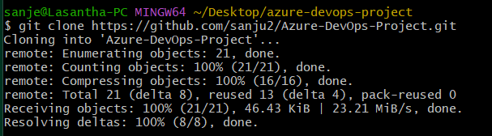

- Step 2 : Create Container registry.

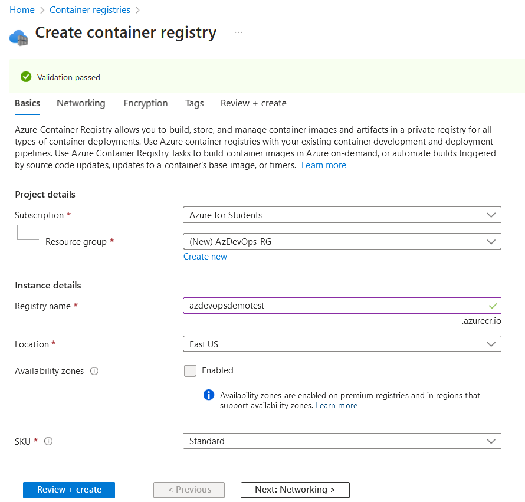

- Step 3 : Create Azure DevOps New Project.

- Step 4 : Inside Azure DevOps project create 2 service connections for the Azure container registry & GitHub.

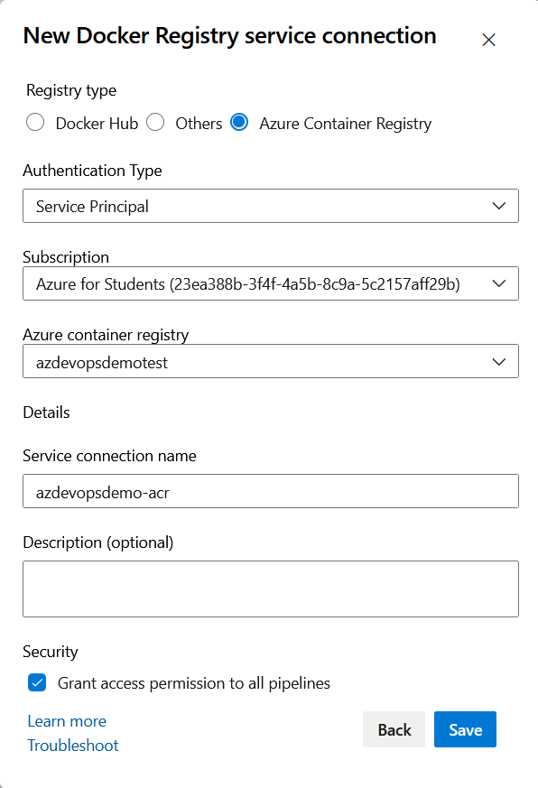

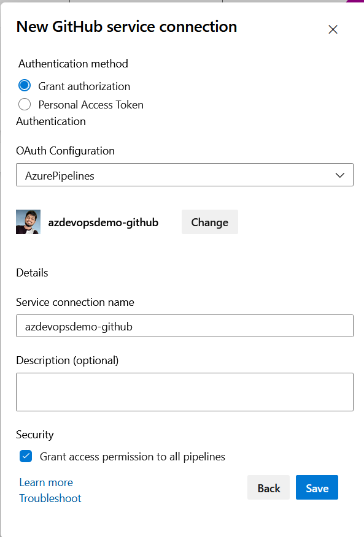

- Step 5 : Create Azure DevOps Build Pipeline.

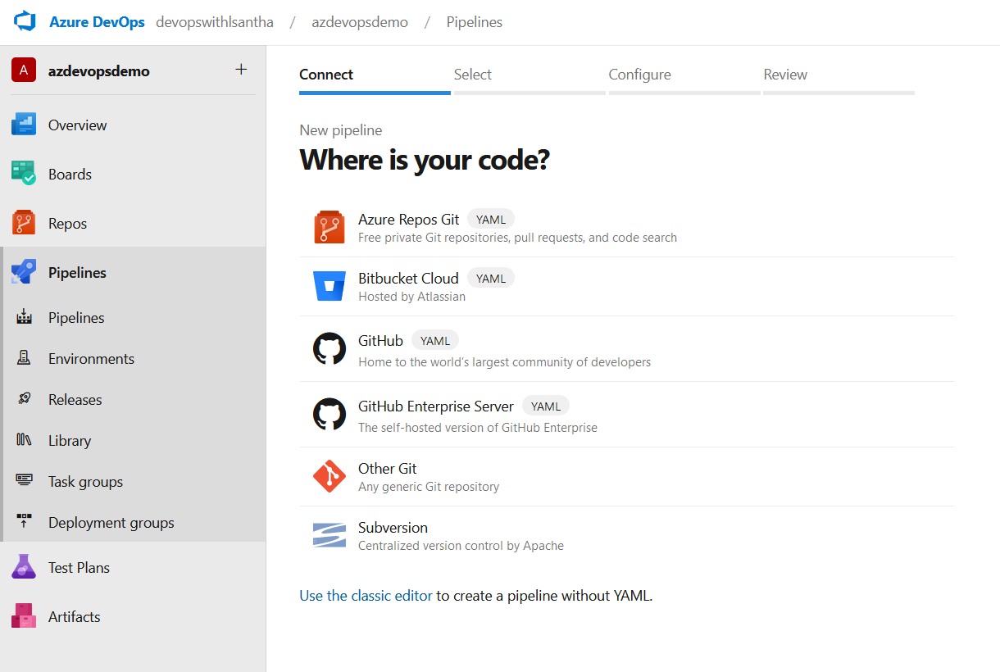

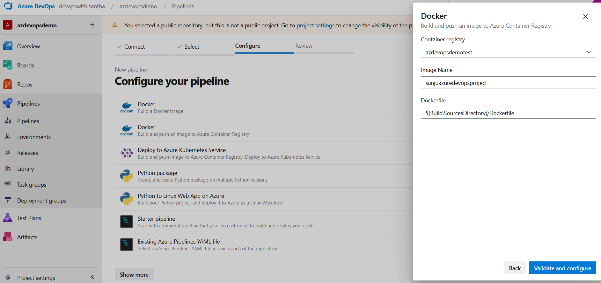

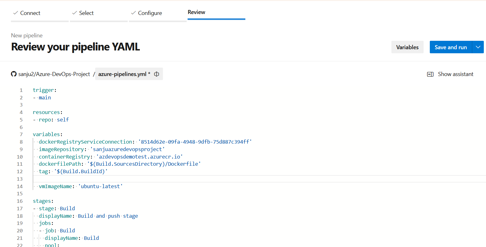

- Step 6 : After running the build pipeline you can see your build pipeline is a success & the docker image is updated.

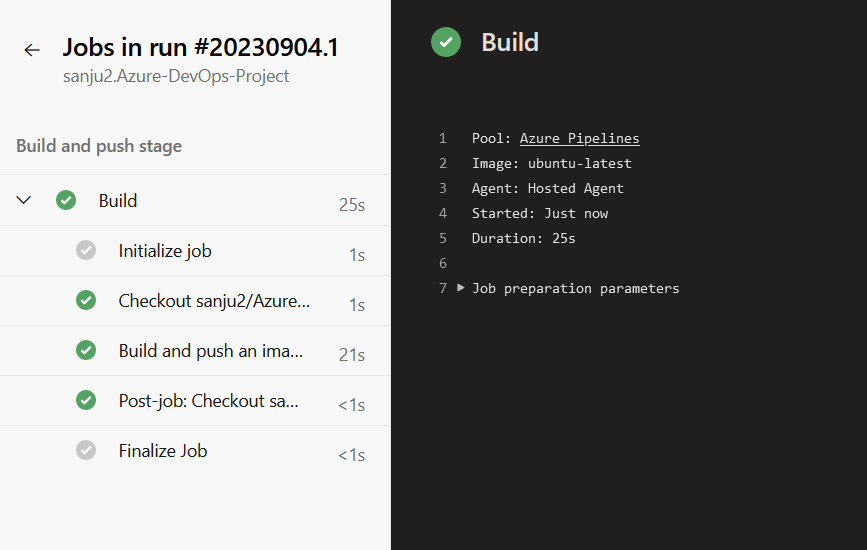

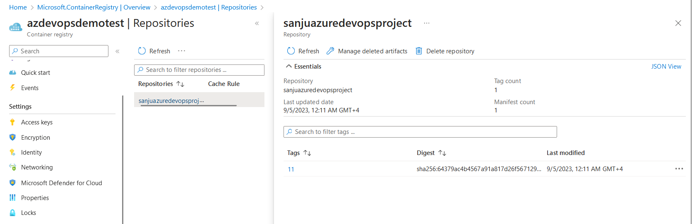

- Step 7 : Enable ECR admin access for deployment to Azure App Service.

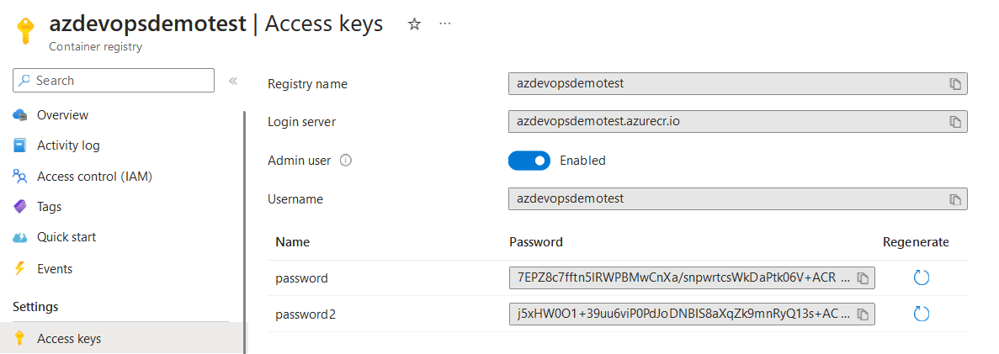

- Step 8 : Create Azure App Service for deploying docker image.

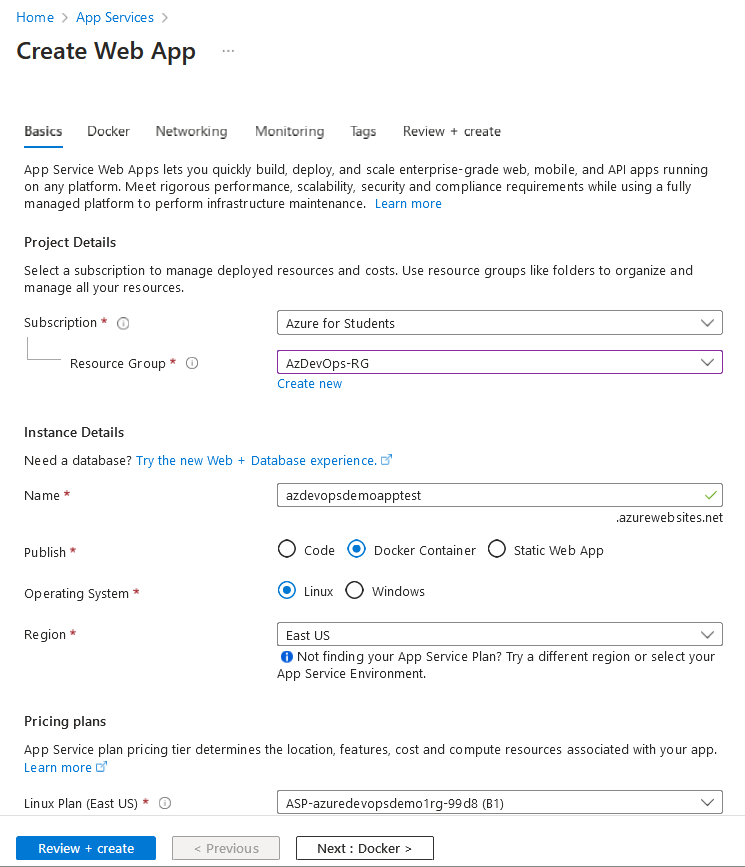

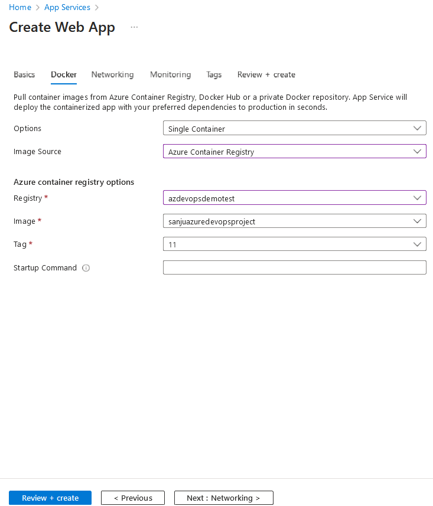

- Step 9 : Create a release pipeline in Azure DevOps.

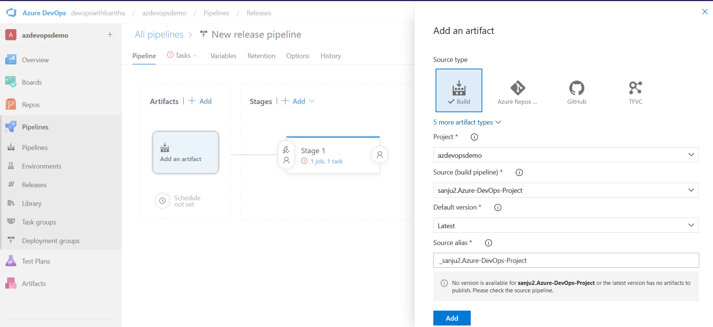

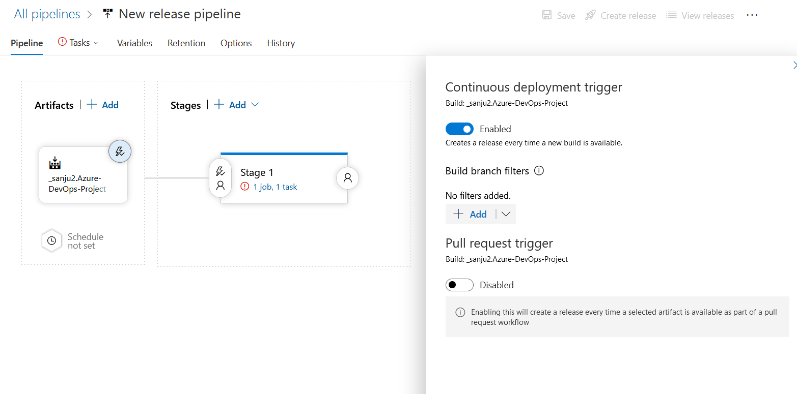

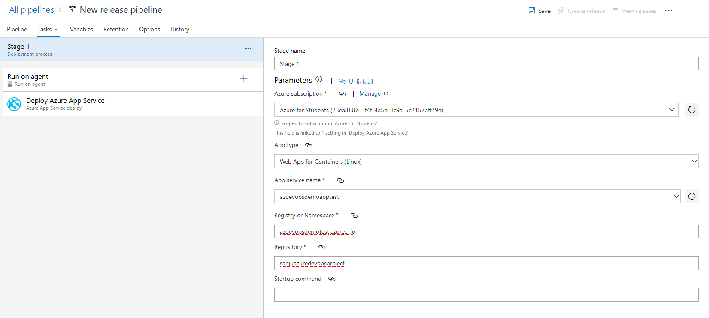

- Step 10 : Deploy 1st release.

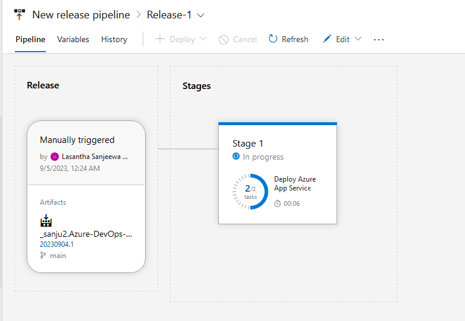

- Step 11 : Add port number in Azure App Service.

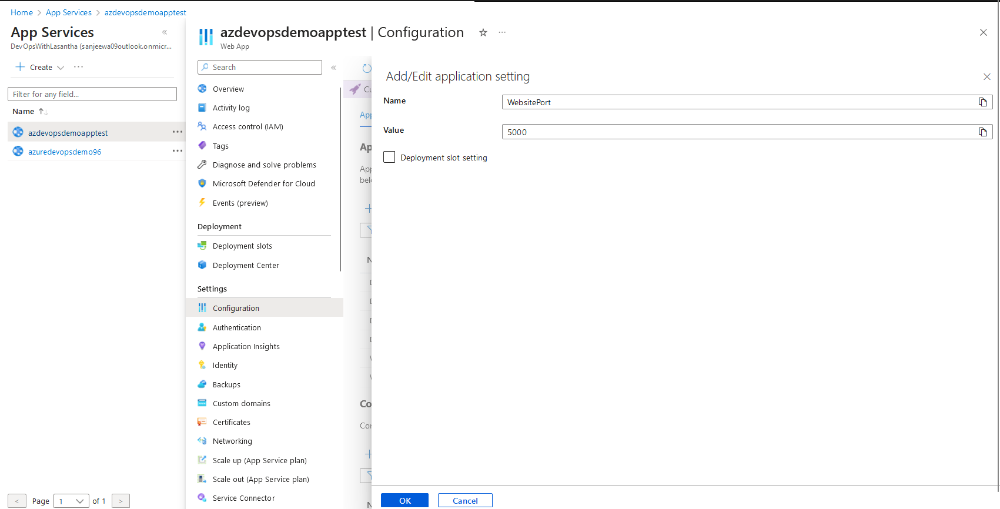

- Step 12 : Finally, Paste the App Service URL in the web browser. You can see the application running.

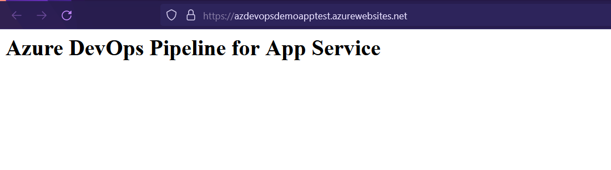

[Learn More Azure DevOps](https://azuredevopslabs.com).

### Thank You! :shipit: